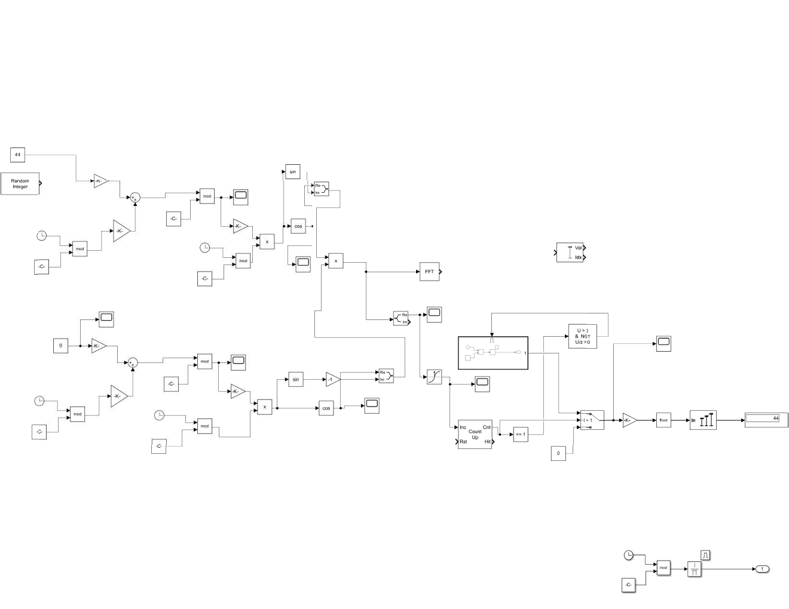
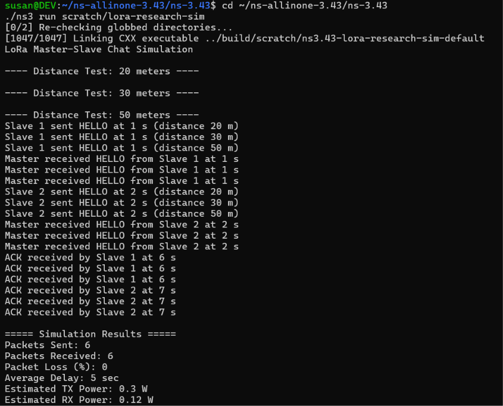

# LoRa-Based Campus Chat System Using Token Passing

A LoRaWAN-based low-power, long-range communication system enabling message passing between distributed nodes across a campus, using a token-passing algorithm to avoid collisions.

## Overview
This project simulates a master-slave LoRa communication network using NS-3, demonstrating collision-free message transmission with 5-second transmit windows per node via a token-passing scheme. A Simulink model (chirp2.mdl) is included to simulate LoRa chirp signal generation and demodulation (CSS modulation).

## Tech Stack
- Simulation: NS-3 (v3.43), MATLAB/Simulink
- Language: C++
- Build system: Ninja

## Repository Structure
├── lora-research-sim.cc   # NS-3 network simulation
├── chirp2.mdl              # Simulink model for LoRa chirp signal (CSS) simulation

## How It Works
- One master node coordinates communication with multiple slave nodes
- Each slave node holds the "token" for a 5-second window to transmit
- Prevents packet collisions common in shared-medium LoRa networks
- Master acknowledges each received message before passing the token
- The Simulink model simulates the physical-layer chirp spread spectrum (CSS) signal used by LoRa for modulation/demodulation analysis

## Running the NS-3 Simulation

cd ~/ns-allinone-3.43/ns-3.43
cp lora-research-sim.cc scratch/
./ns3 run scratch/lora-research-sim

## Running the Simulink Model
1. Open MATLAB (R2021a or later recommended)
2. Open chirp2.mdl
3. Run the model to observe chirp signal generation, modulation, and FFT-based frequency analysis
4. Key blocks in the model: random integer generator, up/down chirp generation (sin/cos), FFT analysis, and a counter-based synchronization block

## Sample NS-3 Results

| Metric | Value |
|---|---|
| Packets Sent | 6 |
| Packets Received | 6 |
| Packet Loss | 0% |
| Average Delay | 5 sec |
| Estimated TX Power | 0.3 W |
| Estimated RX Power | 0.12 W |

Tested at distances of 20m, 30m, and 50m between nodes with zero packet loss at all tested ranges.

## Future Improvements
- Test at longer ranges (500m+) to find real-world threshold distance
- Add dynamic token timeout handling for node failure
- Extend to support more than 2 slave nodes
- Integrate Simulink chirp model output directly into the NS-3 physical layer simulation
